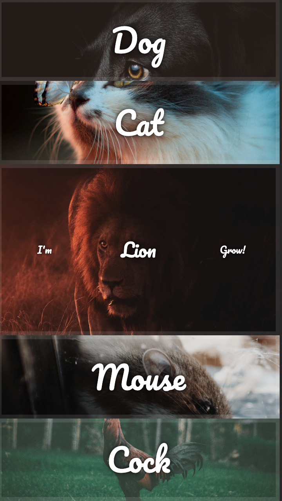
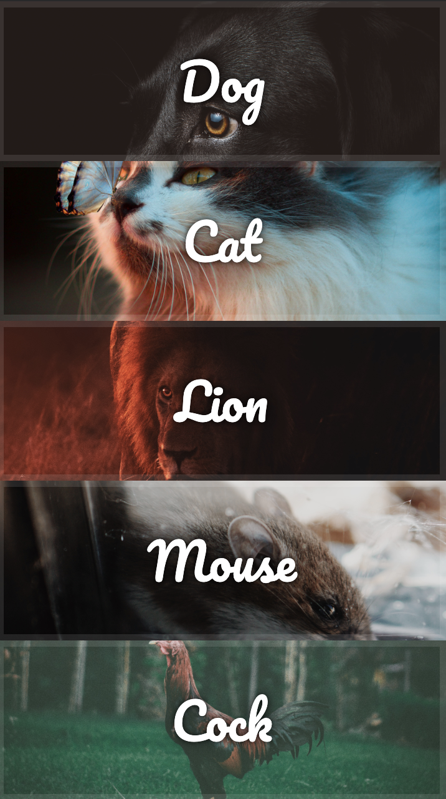

# Responsive Flex Image Gallery

## Support All view port
- mobile
- tablet
- desktop

## Use CSS transition / transform

- Dog image
- Cat image
- Lion image
- Mouse image

## Use Vanila Javascript to control CSS transition

